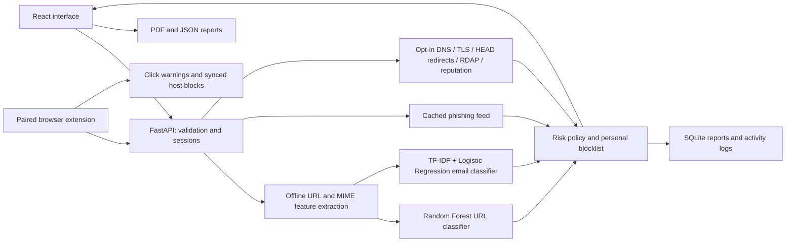

# Phishing Attack Detection and Prevention Using Machine Learning

**Application:** PhishGuard | **Subject:** Computer Networks

## Abstract

This project implements an intelligent local web application that analyzes URLs and email messages for phishing risk. A Random Forest classifier learns from lexical URL features, while TF-IDF and Logistic Regression analyze email content and metadata. Separate calibration data, a modern reserved URL test and configurable threshold reports support evidence-based evaluation. Cached phishing-feed matches and optional DNS, TLS, redirects, RDAP and VirusTotal checks provide distinct evidence layers. The system presents risk scores, warnings, account-specific history and PDF/JSON reports. An optional Chrome/Edge extension checks ordinary clicked links and blocks synced personal hosts before navigation. This remains an educational research prototype; independent modern email evaluation and inbox integration are outstanding.

## Problem and objectives

Phishing uses deceptive links and messages to persuade users to reveal credentials or sensitive data. A static keyword score cannot learn patterns from labeled examples and can flag harmless account pages. This project adds supervised learning, meaningful feature extraction, email inspection and recorded evidence.

1. Validate and normalize URL input before classification.
2. Learn URL patterns from labeled legitimate and phishing examples.
3. Analyze email content, sender/reply metadata, HTML destinations and embedded URLs.
4. Show readable findings, risk estimates and actionable warnings.
5. Gate risky links and retain user-specific blocked hosts inside the application.
6. Evaluate models with held-out metrics and explicitly describe limitations.

## Architecture

Training is separate from inference: public corpora → preprocessing → grouped fit/tuning/calibration/test splits → model selection/training → sigmoid calibration → held-out evaluation → saved artifacts. Starting the API loads models; scanning never retrains them. Local ML and feed lookup do not visit targets; explicit live checks perform bounded public-network observations.

## Computer Networks relevance

The URL path examines schemes, hostnames, ports, IP literals, subdomain structure, user information and encoded characters. Email MIME parsing separates headers, readable body parts, HTML links and attachment metadata. Sender/reply domains and displayed versus actual destinations illustrate spoofing. The report discusses SPF, DKIM and DMARC header observations while distinguishing pasted header claims from genuine cryptographic/server verification. The client communicates with the API over HTTP; server-side sessions and access checks protect account-specific data.

## Algorithms and features

The URL model uses 21 recomputed lexical features: URL/host/path/query lengths, HTTPS presence, IP host, subdomains, hostname hyphens and digits, digit ratio, hostname entropy, path depth, query parameter count, authority @, percent encoding, path double slash, punycode, nonstandard port, shortener flag, keyword counts and hostname keyword counts. No website-derived feature from UCI is used.

The email model uses TF-IDF word unigrams/bigrams and eight metadata features: link count, HTML body part count, reply domain mismatch, displayed link mismatch, attachment count, risky extension indicator, urgency phrase count and credential phrase count. HTML is converted to inert text. Attachments are listed but not opened. Per-message terms shown in reports are positive signed contributions to the linear classifier's log odds. Structural warnings are descriptive rules, not invented feature attribution for the Random Forest.

Random Forest combines predictions from an ensemble of decision trees. Logistic Regression learns coefficients that separate the two classes; TF-IDF weights words by frequency and corpus rarity. Class weighting compensates for imbalance in email examples. See Model Lab for the URL algorithm comparison and global feature importance.

## Evaluation of the supplied artifacts

The positive class is phishing. Metrics use threshold 0.5 on unseen test rows. URL data has zero registered-domain overlap across fit, tuning, calibration and test sets. Email normalized duplicates are removed and matching text-prefix groups are separated across fit/calibration/test. Grouping reduces simple leakage but does not eliminate every related campaign.

| Measure | URL Random Forest | Email TF-IDF + Logistic Regression |
| --- | ---: | ---: |
| Total samples | 40,081 | 3,079 |
| Final training samples | 27,669 | 1,847 |
| Calibration samples | 4,573 | 617 |
| Test samples | 7,839 | 615 |
| Accuracy | 92.24% | 99.35% |
| Precision | 92.67% | 97.14% |
| Recall | 90.93% | 97.14% |
| F1 | 91.79% | 97.14% |
| False-positive rate | 6.56% | 0.37% |
| False positives / false negatives | 269 / 339 | 2 / 2 |

These figures come from `backend/models/metrics.json`. URL training mixes 30,000 UCI URLs with 10,081 PhreshPhish publisher-training URLs. The original UCI-only model produced many false positives on a separate diagnostic slice, motivating this change. Its historical 98% result should not be presented as current real-world accuracy.

A reserved PhreshPhish test-001 slice contains 907 eligible URLs after corpus-domain/invalid-input exclusions: accuracy 80.60%, precision 77.69%, recall 78.09%, F1 77.89%, false-positive rate 17.45% (89 false positives, 87 false negatives). It was reserved before supplemental training. This is a small publisher-order slice, not the full benchmark, and shares the publisher with supplemental training. The initial diagnostic informed development and is not a final hold-out.

Calibration changed test Brier from 0.05941 to 0.06188 for URLs (slightly worse) and 0.00608 to 0.00573 for email (better). Reliability bins and precision/recall/false-positive tables at 30/50/70/90 are displayed in Model Lab. Calibration is dataset-specific; the aggregate policy is not calibrated or separately evaluated. Modern phishing versus old ham source differences still make email metrics optimistic. No independent modern email result is claimed.

## Detection and prevention workflow

1. The user registers or signs in. Passwords are hashed server-side; a random HttpOnly cookie identifies an expiring session.
2. The user pastes a URL or email source, or imports an `.eml` file.
3. The server validates inputs, extracts features and applies the trained models.
4. A report shows risk, measured signals, metadata and actions. Medium/high risk can generate an immediate in-app alert.
5. Hosts can be blocked manually, or optionally automatically for high risk URL estimates.
6. The app's link-opening endpoint denies medium/high risk or blocked hosts. It reevaluates the target and current blocklist rather than trusting an old report.
7. Reports are stored per account and can be exported as PDF or JSON. Raw email bodies are not retained.
8. Cached exact phishing-feed matches and recent reputation findings apply explicit score floors, distinct from the learned prediction. Missing evidence is not a clean verdict.
9. Opt-in target HEAD requests inspect DNS, TLS and up to three redirects; each hop is classified and checked against the feed. RDAP provides registration age when available. No target HTML is loaded.
10. A paired extension pauses ordinary link clicks for a local ML check and syncs up to 1,000 exact-host rules for pre-request navigation blocking. Scoped tokens expire in 30 days and are revocable.

## Testing and privacy

Backend tests cover invalid schemes/hosts, path-versus-host feature extraction, IPv6, Public Suffix List grouping, MIME parsing, script omission, session login/logout, rejected privilege escalation, account isolation, settings, automatic/manual blocking, link access and real model inference. Tests use isolated temporary SQLite databases. Build and lint verify the React application; browser smoke testing verifies rendered results and file exports.

Local scans do not load remote email images or execute HTML/attachments. Live target/provider checks require explicit selection; VirusTotal receives the full URL including query when enabled. Network code rejects private/reserved/link-local addresses, credential URLs and nonstandard ports, pins validated IP sockets, checks each redirect, verifies TLS and bounds request time/size. External failures remain explicit. Tests cover these boundaries, token scopes/revocation, original-byte MIME uploads and saved evaluations. A real isolated Edge extension test verifies pairing, dynamic blocking and risky-click warnings. Saved reports can contain sensitive subject/header/URL metadata; raw email bodies are not retained.

## Scope, limitations and future work

- Prevention includes in-app controls and an optional browser extension. Only synced known-host rules provide pre-request blocking across navigation; new ML checks cover ordinary link clicks. Forms, address-bar ML checks, scripted navigation and every browser context are not covered. This is not a system firewall or inbox filter.
- DNS, TLS, HEAD redirects, RDAP registration and cached reputation/feed checks are implemented as separate evidence layers. Website body/content inspection and attachment malware detection are not implemented.
- Pasted authentication metadata can be forged. Real SPF/DKIM/DMARC verification needs appropriate mail-server evidence.
- Add larger truly independent-source and time-separated tests, more complete near-duplicate clustering, modern mixed-source email labels and evaluation at operational prevalence.
- Email JSONL evaluation exists, but real email-client integration and genuine SPF/DKIM/DMARC validation still require appropriate mail-server evidence.
- A deployment needs HTTPS, secure cookies, host configuration, stronger operational rate limiting, backups and a production service setup; the supplied server binds to loopback for the college demo.

## Demonstration / viva outline

Show the Model Lab and explain the split before quoting accuracy. Scan the ordinary URL sample, then the suspicious reserved-IP sample. Scan the HTML email sample and explain the reply-domain and displayed-link mismatch. Download the report, inspect saved history, block a low risk destination and demonstrate that the server denies it. Explain what TF-IDF, Random Forest, false positives and false negatives mean, and why corpus accuracy is not sufficient for real-world protection.

For the upgraded demo, import an encoded `.eml`, enable a live check for a known public URL and distinguish verified TLS from legitimate identity. Show the feed timestamp and an unavailable external check. Compare same-source and modern test metrics, explain the measured calibration outcome, and demonstrate extension click warnings and a synced browser block. Use reserved-IP examples for suspicious tests; do not visit actual phishing sites for a demonstration.

Dataset sources, licenses and full provenance are documented in `DATASETS.md`.
